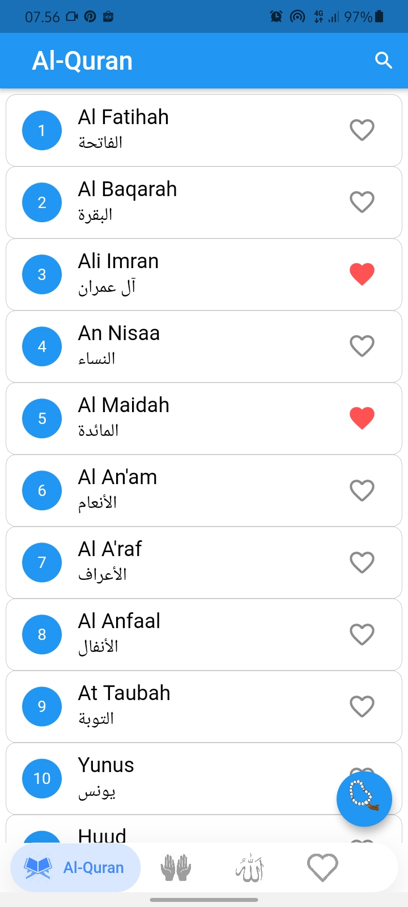
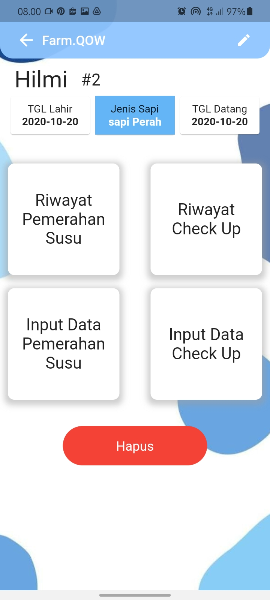

Hello there, I'm Hilmi  👋

I am a third year information systems student with experience in Mobile Programming and Web
Programming. I have worked on various projects and interacted directly with clients. I am a fast learner and
hard worker. I am also capable of public speaking, communication and team management. Wa

I am ready for : 
- FLutter Front-end
- Flutter State Management GetX
- Flutter Firebase
- Front-end Web Dev
- PHP MVC
- PHP Back-end

Ecommerce with PHP MVC :

My-Quran Mobile Flutter; FarmQow FLutter; Sociable Mobile 
     
    
    
    

